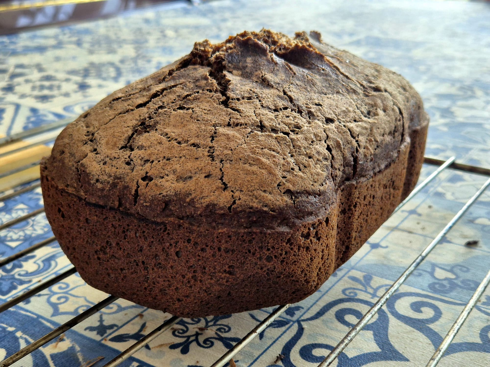

> 🍞 Receta para pan sin gluten ni levadura de algarroba    
> 🍫 Toque chocolateado  
> ⏰ Usando modo solo horneado de panificadora  

## Ingredientes

#### 🥣 Mezcla seca
- **400 g** harina sin gluten del Mercadona  
- **70 g** harina de algarroba  
- **30 g** maicena  
- **8–10 g** olmo rojo
	- o 10–12 g lino molido (2 cucharaditas)
- **1 cucharadita** de sal  
- **2 sobres completos** de gasificante Barrachina *(4 sobrecitos: 2 base + 2 ácido)*
	- o 1 sobre de levadura Royal (14-16 g)
#### 🧪 Mezcla húmeda
- **300 ml** leche vegetal (he usado YoSoy Soja Cacao)
- **220 ml** agua  
  - **→ Total: 520 ml líquido**  
- **3 cucharadas soperas** de aceite *(coco, oliva o girasol)*  
- **1 cucharada sopera** de zumo de naranja *(o limón)*  

---
## 🥄 Preparación

#### 1. Mezcla seca
Mezcla muy bien todos los ingredientes secos en un bol amplio para evitar grumos de algarroba u olmo rojo.

#### 2. Mezcla húmeda (sin el zumo)
En otro bol, combina los líquidos: leche de soja cacao + agua + aceite + zumo de naranja o limón.

#### 3. 👀 Engrasa la cubeta de la panificadora

#### 4. Integración
Vierte los líquidos sobre los secos y mezcla rápidamente hasta obtener una **masa espesa y pegajosa**
**Trabaja rápido**: el gas se activa en el momento y se pierde rápido! (máximo 3 minutos).

#### 5. Molde y horneado
- Pasa la masa a la cubeta de la panificadora (engrasada).  
- Alisa la superficie con espátula húmeda.  
- Usa el programa **solo horneado**, **tostado medio**, **50–55 minutos**.

#### 6. Enfriado
Deja reposar **1 hora fuera de la cubeta** antes de cortar para que la miga asiente bien.

---

### ✨ Notas
- Si la masa queda demasiado compacta, añade 10–15 ml más de agua.  
- Si queda demasiado fluida, añade 1 cucharada de harina sin gluten.  
- La algarroba oscurece la miga y aporta sabor dulce natural.  
- El olmo rojo genera una textura más tierna y uniforme que el lino.