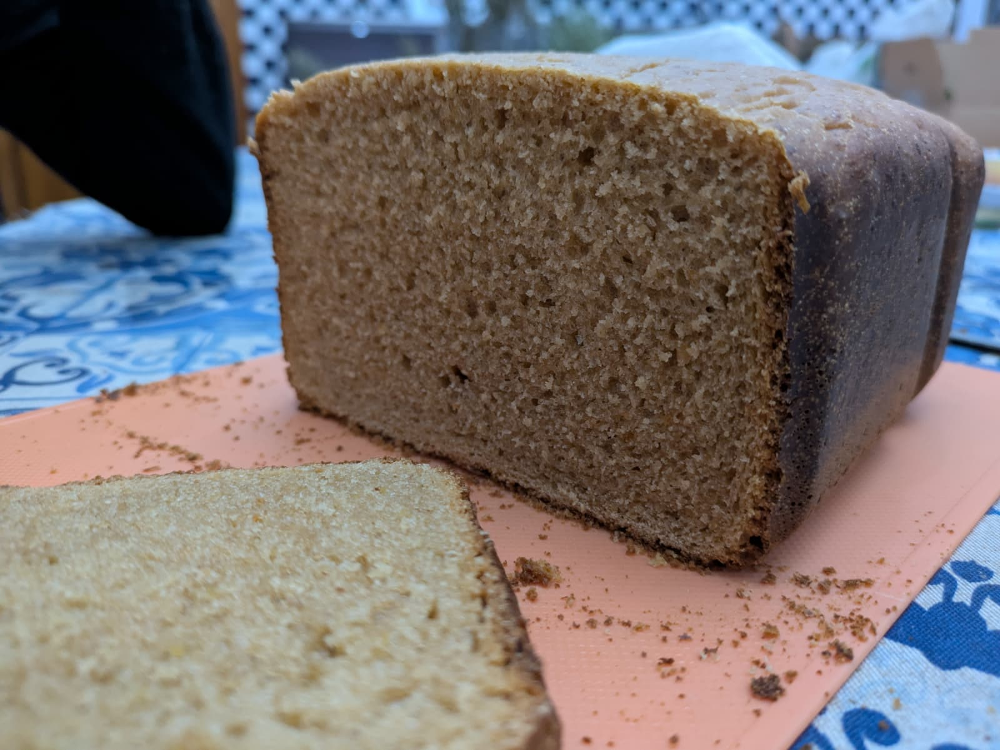
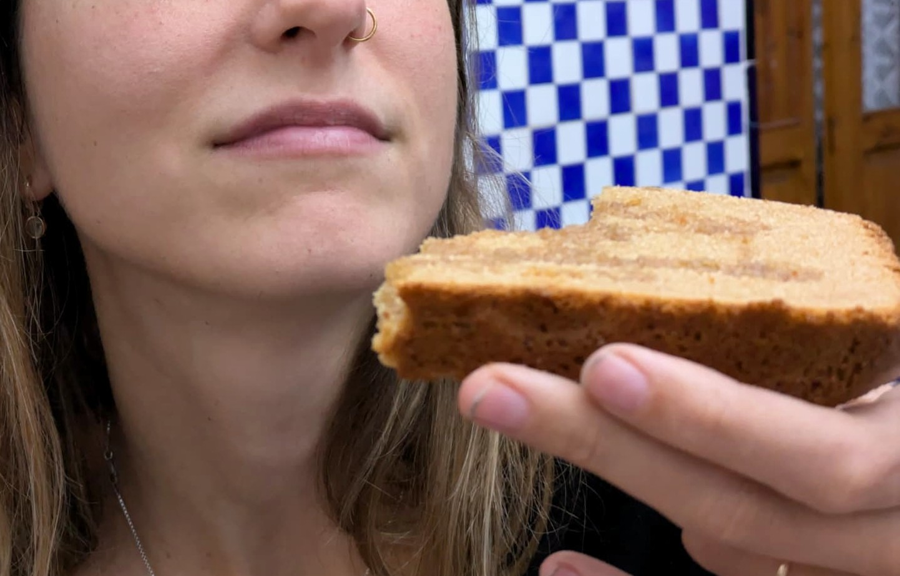

> 🍞 Con masa madre de espelta + 4 g de levadura fresca (panificadora)  
> ⚖️ Peso final aprox.: 1 kg  
> ⏰ Fermentación lenta (6–8 h a 15–19 °C)  
> ✨ Método digestivo
> 🪷 Energía MTC: neutro, ligeramente frío

### 🌾 Ingredientes

- 450 g de harina integral de centeno  
- 100 g de harina de trigo blanca (si de fuerza, usar +40ml de agua!)
- 450 ml de agua templada (35–40 °C)
- 120 g de masa madre de espelta activa (100 % hidratación)  
- 4 g de levadura fresca  
- 8 g de sal marina  
- 6 g de panela (1 cucharadita rasa)
- 9 g de aceite de sésamo o de oliva

### ⚙️ Proceso (en panificadora)

#### 1️⃣ Mezcla inicial
1. Aceita la cubeta! Se pega mucho menos la masa y luego es más fácil sacar la masa
2. En la cubeta, disuelve la levadura y la panela en el **agua templada**
3. Añade el **aceite** y la **masa madre de espelta**, remueve ligeramente.
4. Incorpora las **harinas** y mezcla con el programa (9) de amasado **10 minutos**
   - La masa debe quedar densa y húmeda, tipo barro espeso.
5. Una vez mezclado, se añade la sal para que se integre
#### 2️⃣ Opcional e infernal
(Ojo, no tan infernal si se ha aceitado la cubeta!) Sacar la masa, limpiar los restos de harina, quitar las palas de amasado y aceitar un poco la cubeta antes de volver a meter la masa (si está muy pegajoso, mojar con agua).
#### 3️⃣ Fermentación principal
- Deja la masa **dentro de la panificadora apagada y cerrada**, durante **6–8 horas** a temperatura ambiente (6h si hace ~23°C, 8h si hace ~15°C)
- Estará lista cuando la superficie esté **ligeramente abombada o agrietada**, con un aroma ácido suave.
#### 4️⃣ Horneado
- (Opcional) Pincela con aceite la superficie para que quede mas suave
- Programa **solo horneado** 60 minutos, nivel de tostado alto.
- Al terminar, deja la tapa **entreabierta** unos 10–15 min → se va el vapor sin un choque térmico
- Después, saca el pan de la cubeta y deja **enfriar 8–10 horas** sobre una rejilla antes de cortar.

## 🌿 Notas finales

- No te alarmes si la masa parece húmeda: el centeno se solidifica al hornear.
- Guarda el pan en un **paño de lino o algodón grueso**.  
- Se conserva tierno **5–6 días**, y tostado al segundo día está espectacular.  
- Ideal con hummus, aguacate, fermentados o simplemente con aceite y sal.