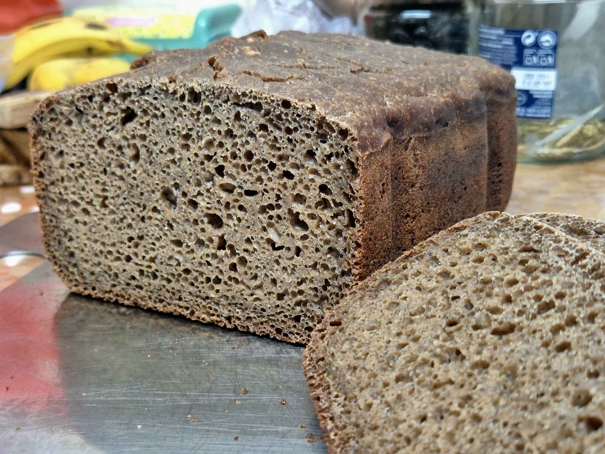
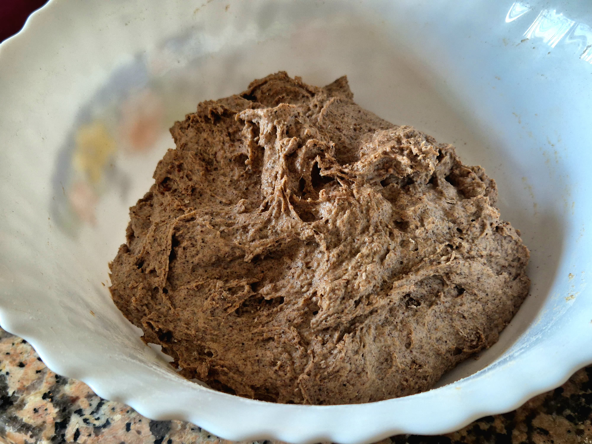

> Pan rústico con base de trigo blanca y toque de algarroba y sarraceno. Fermentación larga en frío, miga suave y corteza crujiente.
> - Digestivo gracias a la fermentación prolongada
> - Textura ligera y rústica, sabor dulce natural
> - 🪷 Energía MTC: neutra

## 🌾 Ingredientes

### Mezcla seca
- Harina de trigo blanca (375 g)
- Harina de algarroba (60 g)
- Harina de arroz o sarraceno (90 g)
- Sal (11 g) (Ajustable según gusto)

### Mezcla húmeda
- Agua templada 25–28 °C (350 ml)
- Aceite suave (19 g)
- Masa madre (260 g si está pocha, 100% hidratación)
- Levadura seca de panadería (7-9 g, opcional pero recomendable si la masa madre está pocha)

## ⚙️ Preparación

### Paso 1: Autólisis

- Mezclar todas las harinas + el agua principal (sin sal ni grasa) hasta formar una masa húmeda pero sin amasar demasiado.
- Reposar 30–60 min. Esto permite que la harina absorba agua, el gluten se desarrolle de forma natural y la algarroba se hidrate bien.

### Paso 2: Hidratación inicial
- Añadir el aceite y la masa madre
- Mezclar hasta obtener una masa homogénea y pegajosa.
- Añadir la sal y mezclar suavemente.

### Paso 3: Activación / fermentación
- Espolvorear la levadura seca sobre la masa (si se usa) y mezclar suavemente durante 1–2 min.
- Incorporar la masa madre con movimientos suaves.
- Hacer 3–4 pliegues durante 2–3 h a temperatura ambiente (30–40 min entre pliegues).
- Colocar la masa en la nevera 12 h (o hasta 18–20 h) para fermentación lenta.

### Paso 4: Cocción / horneado
- Sacar de la nevera y dejar templar 20–30 min.
- Formar suavemente una bola tensa sin desgasificar en exceso.
- Colocar en la cubeta aceitada de la panificadora.
- Dejar levar 20–40 min hasta notar un ligero aumento de volumen.
- Método: panificadora (sólo horneado)
- Tiempo: 60–65 min | Intensidad: alta
- Test de cocción: golpear la base → sonido hueco.

### Paso 5: Enfriado / reposo
- Sacar de la cubeta y dejar enfriar mínimo 2 h.
- Motivo: permitir que la miga se asiente y la humedad interna se distribuya.

## 🌿 Notas finales / ideas / consejos

- Si quieres miga más abierta, aumentar un poco la hidratación (10–15 ml más de agua).  
- Para pan más compacto, reducir agua o alargar ligeramente pliegues.  
- Conservación: 3–4 días a temperatura ambiente en bolsa de tela; se puede congelar en rebanadas.
- No fiarse del color: la algarroba oscurece la miga aunque esté completamente horneado.  
- Para versión más dulce, se puede cambiar el aceite por sirope de arce en la mezcla húmeda.
