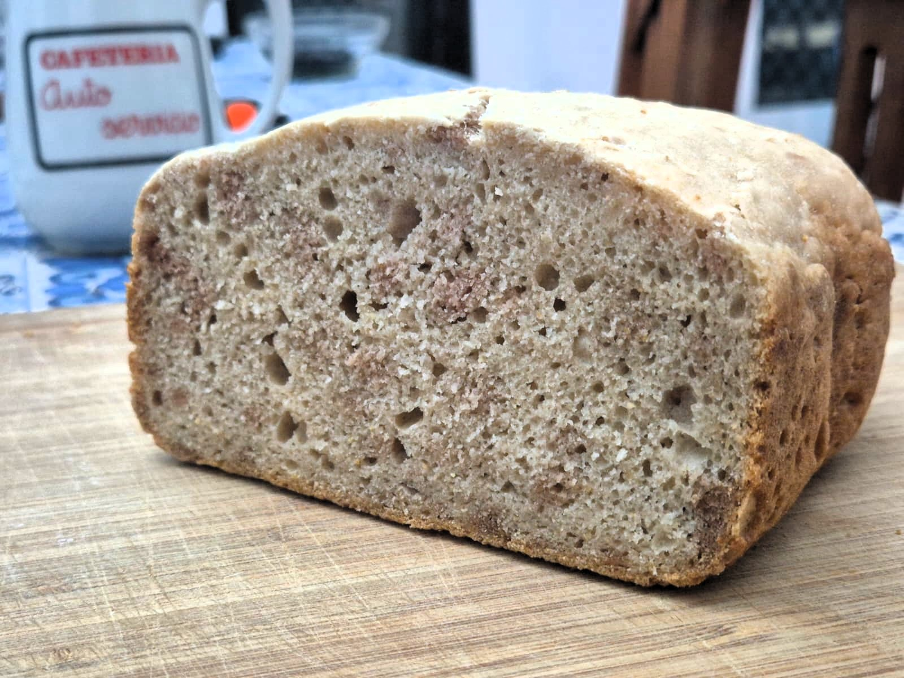
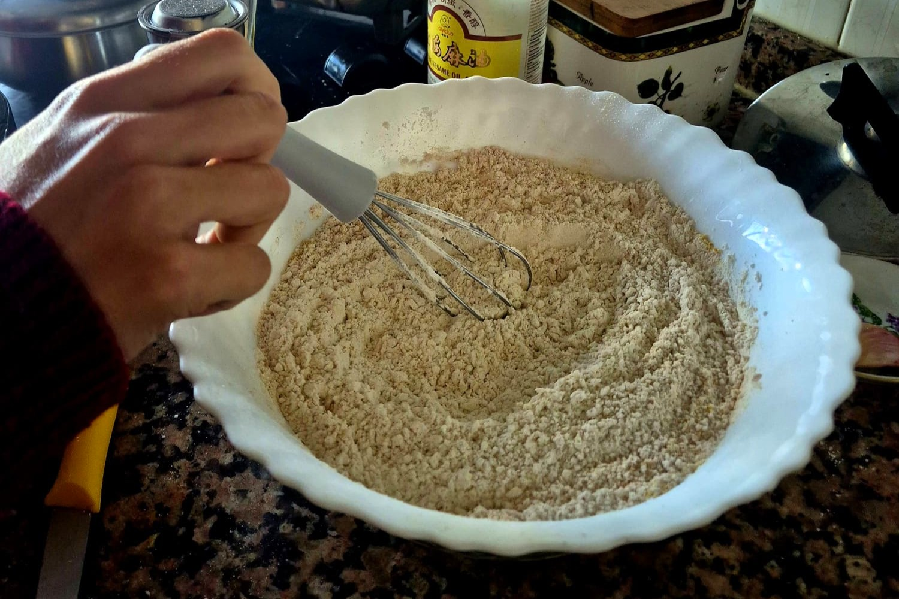
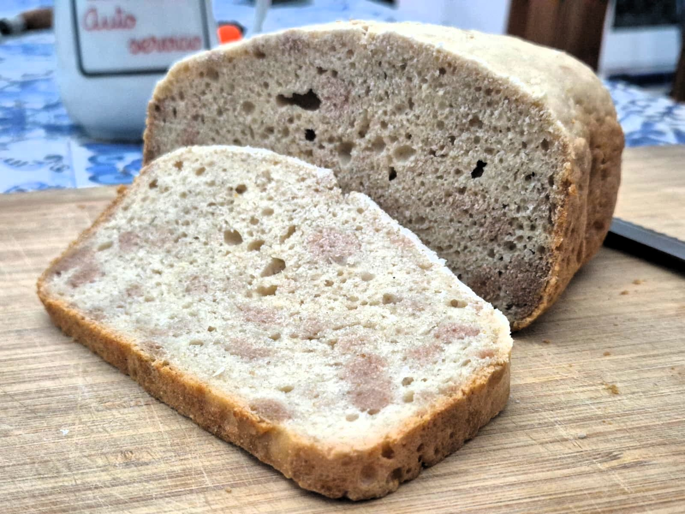

> Receta para pan sin gluten ni levadura, usando modo solo horneado de panificadora.
> - Muy digestivo y liviano
> - 🪷 Energía MTC: neutra-ligeramente fría

## Ingredientes

### Mezcla seca
- 450 g de harina sin gluten del Mercadona (con aglutinantes tipo psyllium)
- 50 g de maicena
- 2 sobres *de bicarbonato* de gasificante Barrachina
	- Serán 4 sobrecitos en total (2 de cada)
	- Tambien se puede con 20-24g de levadura/gasificante Royal
- 2 (≈ 10-12 g) cucharadas soperas de lino molido (opcional, pero da estructura extra)
	- 1 cucharada de lino (5–6 g)
	- 1 cucharadita colmada de Olmo rojo (slippery elm) (3–4 g)
- 1 cucharadita de sal (≈ 5 g)
### Mezcla húmeda
- 2 sobres *de ácido* del gasificante Barrachina
- Al menos 500 ml de agua o leche vegetal (la de soja le da azucares que doran mejor y carameliza un poco)
	- **300 ml** leche vegetal de soja sabor vainilla
	- **200 ml** agua (para rebajar el dulzor)
- 3 cucharadas **soperas** de aceite (≈ 40 g)
	- 1 cucharada soperas aceite de sésamo
	- 2 cucharadas soperas aceite de girasol
- Cucharada sopera de zumo de limón (opcional pero mejora gasificante)

## Preparación

### Paso 1: Mezcla seca
En un bol grande, mezcla:
- Harina sin gluten
- Solo los sobrecitos de **bicarbonato** (NO los de ácidos todavía)
- Sal
- Lino molido

### Paso 2: Primera hidratación
- Añade 2/3 del líquido (unos 300ml) sin los ácidos
- Añade el aceite
- Mezcla bien hasta integrar completamente
- La masa quedará tipo "pasta espesa", más líquida que un pan tradicional
- Deja que se hidrate la mezcla 3-5 mins
- Engrasa la cubeta de la panificadora

### Paso 3: Activación del gasificante
- Disuelve los 2 sobrecitos de **ácidos** en el 1/3 restante de líquido (150ml aprox)
- Añade este líquido ácido a la masa
- Mezcla con movimientos suaves y rápidos (verás que burbujea)
- **¡Rápido! Tienes 2-3 minutos antes de perder el gas**

### Paso 4: Horneado
- Vierte inmediatamente en el molde de la panificadora (engrasado)
- Alisa la superficie con espátula mojada
- Activa modo solo horneado 55 minutos **tostado medio**
- Test: pincha con palillo en el centro, debe salir limpio

### Paso 5: Enfriado
**IMPORTANTE**: Deja enfriar COMPLETAMENTE antes de cortar (mínimo 1 hora). El psyllium necesita tiempo para asentar o se desmigajará.

## Notas

- Si la masa queda muy espesa, añade un poco más de líquido (de 10 en 10ml)
- Si queda muy líquida, añade 1-2 cucharadas de harina
- El pan quedará más denso que uno de levadura, textura tipo bizcocho salado
- Se conserva 2-3 días en bolsa cerrada, o congela en rebanadas

## Variaciones

- Añade semillas (girasol, calabaza, sésamo) antes de hornear
- Sustituye 50-100g de harina por harina de garbanzo para más proteína
- Añade hierbas aromáticas (romero, orégano) a la mezcla seca