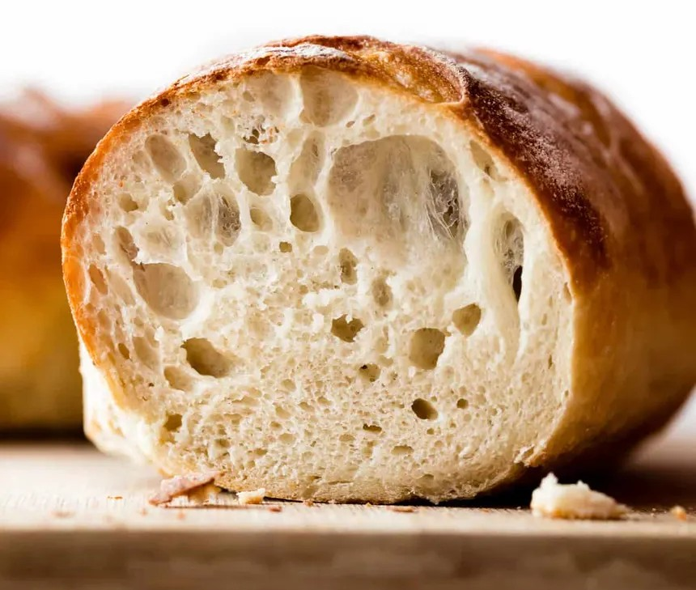

> Pan sencillo, honesto y muy agradecido, ideal para primeros panes.
> - Mínima intervención, máxima probabilidad de éxito
> - Miga abierta y sabor suave gracias a la fermentación lenta
> - 🪷 Energía MTC: neutra–templada

## Ingredientes

### Mezcla seca

- Harina de trigo (500 g)
- Levadura seca de panadero (5 g)
- Sal marina fina (10 g)

### Mezcla húmeda

- Agua templada (375 ml)
    - Uso completo en la mezcla
- Aceite de oliva virgen extra (1 cucharada, opcional, pero gana en textura)

## Preparación

### Paso 1: Mezcla seca
En un bol grande mezcla bien la harina, la sal y la levadura seca.

### Paso 2: Mezcla húmeda
Añade el agua templada y el aceite.  
Mezcla con cuchara o con la mano **solo hasta que no quede harina seca**, no hace falta amasar de más.  
La masa será blanda y pegajosa: es lo deseable.

### Paso 3: Proceso
Tapa el bol y deja fermentar a temperatura ambiente **entre 8 y 12 horas**  
(idealmente de un día para otro).  
La masa crecerá y mostrará burbujas en la superficie.

Tras la fermentación:
- Vuelca la masa sobre una superficie ligeramente enharinada
- Dóblala sobre sí misma 2–3 veces
- Forma una bola sin tensar en exceso
- Deja reposar tapada **30–45 minutos**

### Paso 4: Cocción / horneado

- Verter en el molde o colocar como hogaza sobre bandeja
- Ajustar superficie suavemente
- Método: horno
- Tiempo: 10 min a 220 °C + 25–30 min a 200 °C | Intensidad: media–alta
- Opcional: recipiente con agua en el horno los primeros 10 min
- Test de cocción: al golpear la base suena hueco

### Paso 5: Enfriado / reposo

- Tiempo mínimo de enfriado: 30 minutos
- Motivo técnico: la miga termina de asentarse y se redistribuye la humedad

<!--  -->

## Notas

- Ajustes de textura:  
  - Masa seca → añade 1–2 cucharadas de agua  
  - Masa muy líquida → espolvorea un poco de harina al formar
- Resultado esperado: corteza crujiente, miga húmeda y alveolada
- Conservación:  
  - 2–3 días envuelto en paño  
  - Congela bien en rebanadas

## Variaciones

- Añadir 10–20 % de harina integral
- Hornear en molde tipo pan de molde
- Incorporar semillas (sésamo, girasol) en el formado final
